# CVLab Semester Project: Bin Clearing for Stacked Objects

**Rim El Qabli**, Supervisor: Corentin Dumery, Professor: Pascal Fua  
*Master's Semester Project, CVLab, EPFL*

<p align="center">
  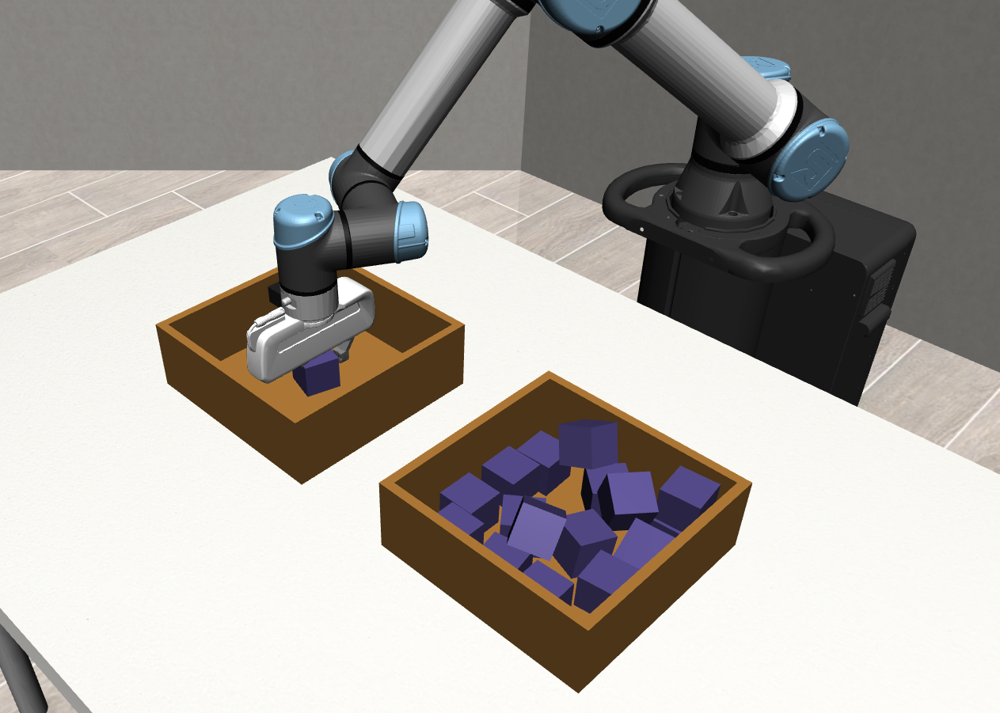<br>
  <em>A UR5e arm clearing a bin of stacked blocks, one grasp at a time, in MuJoCo.</em>
</p>

## What this project is

In this project, we explore robotic bin clearing. A UR5e arm fitted
with a parallel-jaw gripper has to empty a source bin packed with stacked blocks
into a destination bin, one grasp at a time, inside a MuJoCo simulation. Every
grasp is scored by a hybrid-physics check that decides whether the pick would
have worked and how much it disturbs the rest of the pile.

The project asks one question with two halves. First, is an off-the-shelf depth
grasp detector good enough to clear a cluttered bin? Second, once perception is
taken out of the equation and every method sees the same clean set of objects,
how much does the choice of which object to grab next really matter?

To answer this, five candidate-selection policies are compared on the exact same
scenes and paired random seeds:

- `greedy_ggcnn`: runs the GG-CNN depth grasp network on the real depth image and picks its highest-quality grasp
- `random`: picks a visible object uniformly at random
- `topdown`: picks the object whose top sits highest
- `heuristic_augmented`: a staged hand-written rule
- `rl`: a MaskablePPO agent trained on cluttered n=20 scenes

Only the first policy runs on real perception. The other four are fed by a
perfect-perception oracle that returns one clean candidate per visible object,
and that is what lets us pull the perception question apart from the policy
question.

## Headline finding

Perception is the bottleneck. A policy as naive as `random`, running on the
oracle candidate stream, beats `greedy_ggcnn` by a wide margin at every clutter
level, and this is the largest effect in the whole study. Once perception is
perfect the selection policies nearly saturate, so even `random` becomes a
strong baseline that is hard to beat. The learned MaskablePPO policy comes out
ahead only at the highest clutter level (n=20, about 13.68 items delivered
against 12.62 for random), while at n=10 and n=15 it ties or trails `random`.
Greedy GG-CNN collapses in clutter because it fixates on the high-contrast inner
rim of the bin instead of the objects. The accompanying project report carries
the full methodology and discussion.

## Watch it run

<p align="center">
  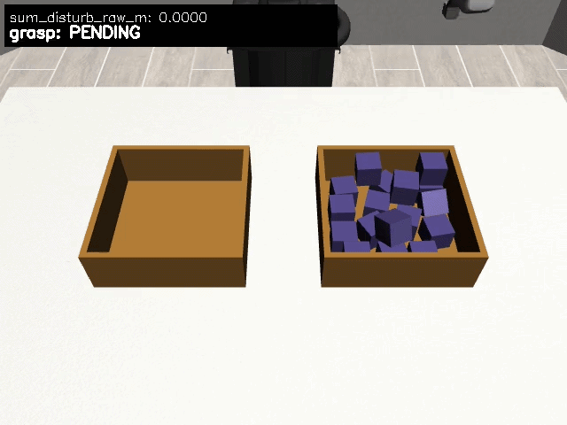
  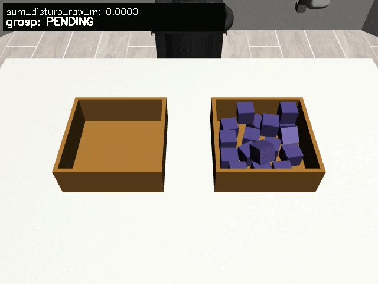<br>
  <em>Same scene, two methods. Left, the RL policy picks a top object and delivers it. Right, GG-CNN closes on the bin rim.</em>
</p>

Both clips start from the same scene. The learned policy reaches for an
accessible object near the top of the pile and carries it across, while GG-CNN
aims at the rim and comes back empty.

## The data behind the task

<p align="center">
  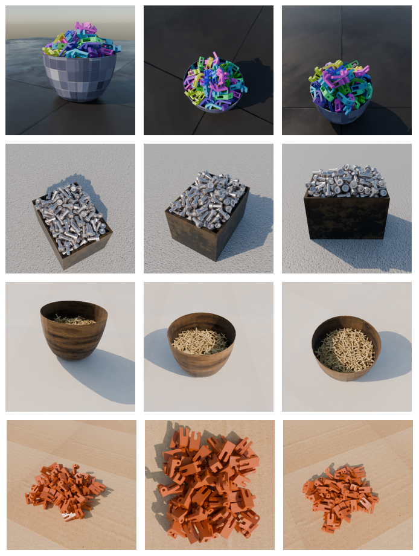<br>
  <em>Stacked-object scenes from the StackCounting dataset. Rich geometry, but no grasp labels.</em>
</p>

The stacked-block scenes and container meshes are built on the StackCounting
dataset from the CVLab group. The dataset offers abundant geometry and realistic
piles but no grasp annotations, which is exactly the setting where an
off-the-shelf detector or a learned selector has to earn its keep.

## The environment

<p align="center">
  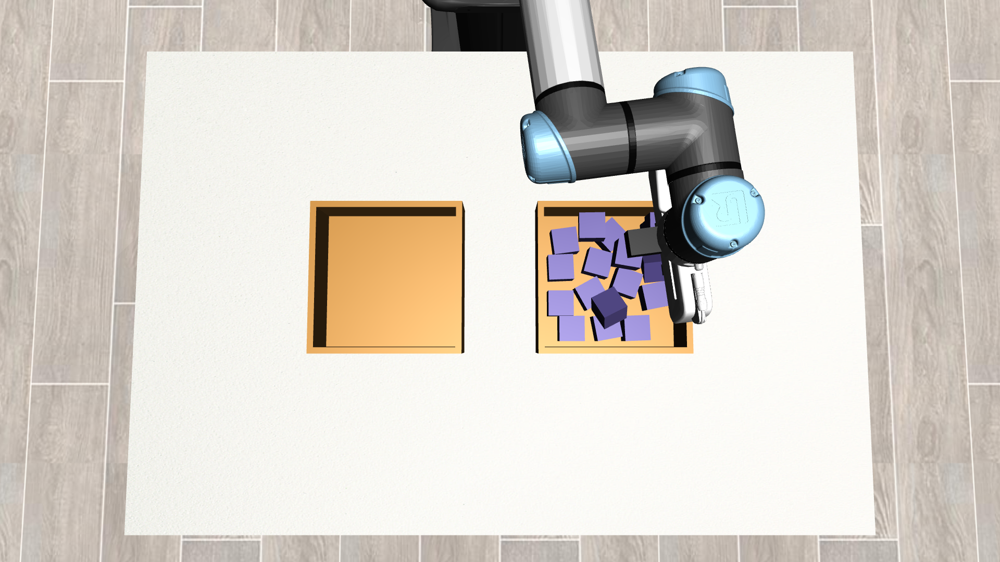
  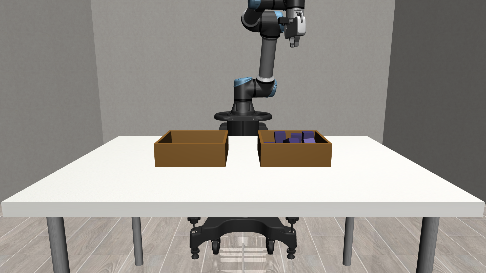<br>
  <em>Overhead and front views. A full source bin on the right, an empty destination bin on the left.</em>
</p>

The scene is built in robosuite on top of MuJoCo. A UR5e arm with a parallel-jaw
gripper works over two bins, a source bin that starts full and a destination bin
that starts empty. Every policy reads the same fixed overhead camera, so they
all act on the same view of the pile.

## How it works

<p align="center">
  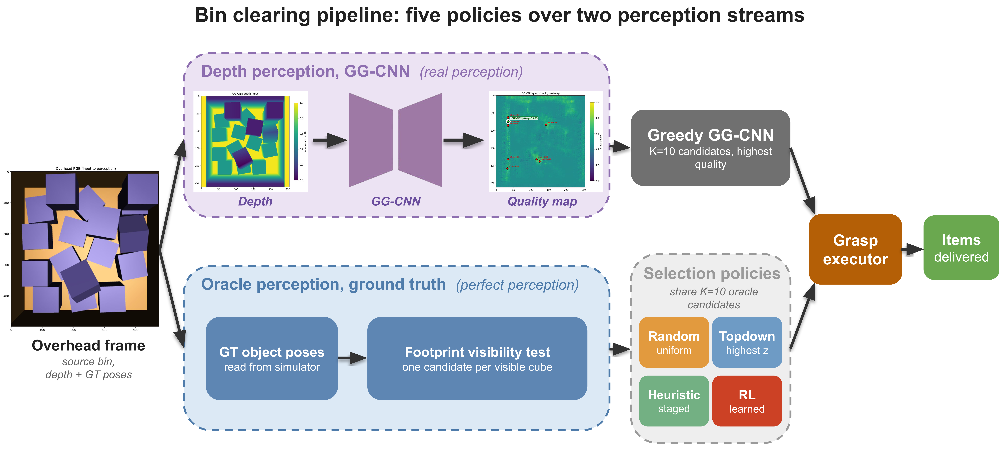<br>
  <em>One pipeline, five policies, two perception streams.</em>
</p>

Every method shares the same pipeline. An overhead frame enters one of two
perception streams. The real stream feeds the depth image to GG-CNN, which
predicts a grasp-quality map and proposes candidates. The oracle stream reads
ground-truth object poses from the simulator and runs a footprint visibility
test to emit one clean candidate per visible object. A selection policy then
chooses a candidate, the grasp executor attempts the pick, and a delivered
object is counted. All five policies plug into this single pipeline, which keeps
the comparison fair.

## Why an off-the-shelf detector is not enough

<p align="center">
  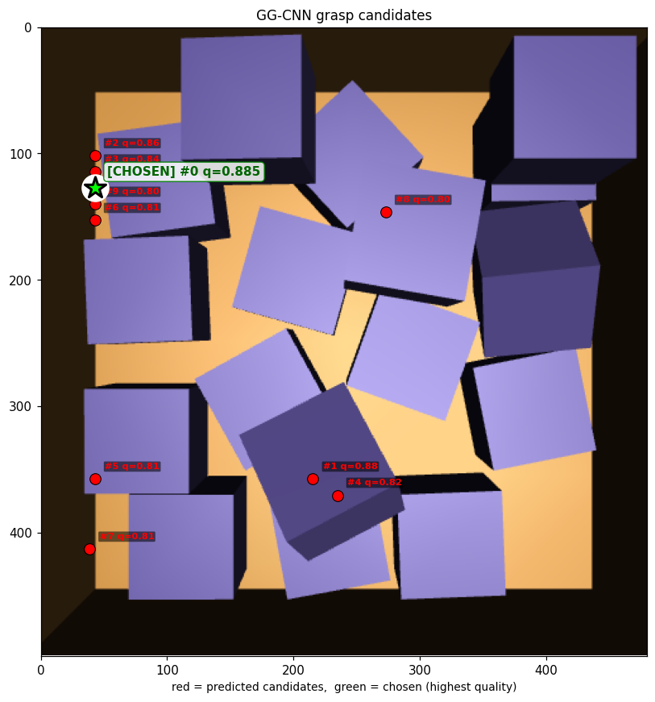
  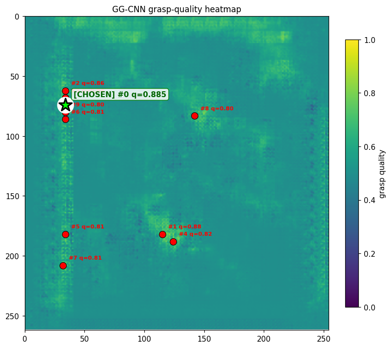<br>
  <em>GG-CNN on a full bin. Its chosen grasp lands on the bin rim, and its quality map peaks on the rim rather than on a block.</em>
</p>

GG-CNN predicts a grasp for every pixel from a single depth image and was
trained on isolated objects against a plain background. Pointed at a full bin it
latches onto the sharp depth edge of the inner rim, scores it as the best grasp,
and closes the gripper on nothing. This is the perception gap that the oracle
stream removes.

## Results

<p align="center">
  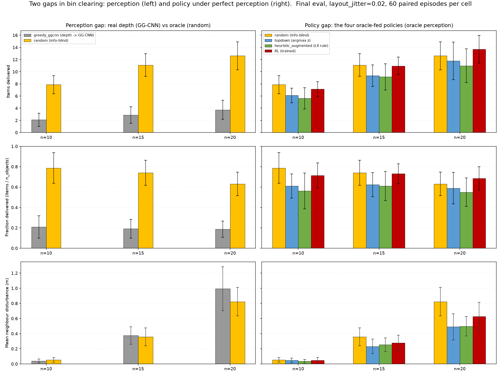<br>
  <em>Two gaps. Left, the perception gap, real depth GG-CNN against the oracle-fed random baseline. Right, the policy gap, the four oracle-fed policies. Rows are items delivered, fraction delivered, and neighbour disturbance.</em>
</p>

The left column is the perception gap. Handing `random` clean candidates lifts
items delivered from the 2 to 4 range for GG-CNN up to the 8 to 13 range, at
every clutter level. The right column is the policy gap, with all four policies
on the same perfect perception. Here the bars sit close together. `random` is a
strong baseline, the learned policy edges ahead only at n=20, and the ordering
barely moves otherwise. In short, fixing perception buys far more than polishing
the selection policy.

## The learned policy

<p align="center">
  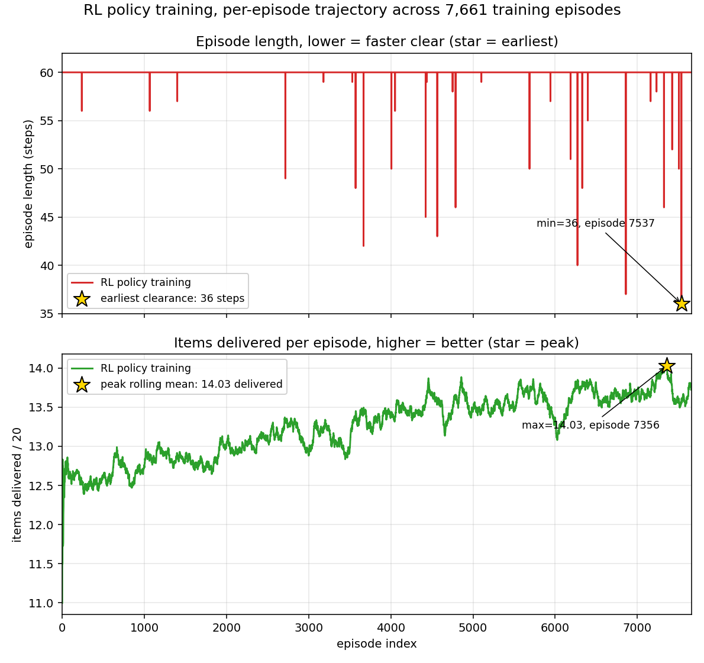<br>
  <em>Training trajectory over 7,661 episodes. Items delivered rise from about 12.6 to roughly 14 per episode as the agent learns.</em>
</p>

The RL policy is a MaskablePPO agent. Each action picks one oracle candidate
together with a small nudge in x, y, and yaw, which gives a 270-way discrete
choice. The reward rewards delivered objects and penalises empty grabs and
objects knocked out of the bin. Action masking hides invalid options and any
object that just failed, so the agent does not fixate on a single target.
Training runs on cluttered n=20 scenes and settles at about 14 items delivered
per episode.

## Setup

```bash
conda create -n cvlab_project python=3.9
conda activate cvlab_project
pip install -r requirements.txt
```

The GG-CNN model code and pre-trained Cornell weights used by the `greedy_ggcnn`
policy are bundled under `third_party/ggcnn/` (BSD-3 license retained). No
external clone or weights download is required.

Required environment variables for headless rendering and import resolution:

```bash
export MUJOCO_GL=egl
export PYTHONPATH=$PWD
```

All commands below assume the repository root (`cvlab_project_final/`) is the
current directory.

## How to run

### Train the RL policy

Defaults are fine for a smoke-test run. To reproduce the frozen submitted
checkpoint use the full command below, which matches
`rl/models/training_config.json`:

```bash
python scripts/train.py \
    --algo maskable_ppo --reward_mode hybrid_physics \
    --total_timesteps 500000 --n_objects 20 --seed 0 --n_envs 14 \
    --run_name rl_v5_l1_l4_action_augmented_n20 \
    --checkpoint_freq 10000 --eval_freq 10000 --eval_episodes 30 \
    --ent_coef 0.01 --n_steps 2048 --batch_size 64 \
    --disturb_coef 2.0 --layout_jitter 0.02 --K 10 --candidate_source ppo
```

The shipped `rl/models/best_model.zip` is the checkpoint loaded by all
evaluation and demo scripts.

### Evaluate all 5 policies on paired seeds

```bash
python scripts/eval_4method.py \
    --policies greedy_ggcnn,random,topdown,heuristic_augmented,rl \
    --n_objects 10,15,20 --n_episodes 60 --seed_offset 1000 \
    --layout_jitter 0.02 --reward_mode hybrid_physics \
    --rl_model_path rl/models/best_model.zip \
    --output_dir results/my_eval
```

This writes `per_attempt.csv` and `per_episode.csv` under the output directory.
To turn those CSVs into the plots shown in `results/`, see the next section.

### Re-generate plots from frozen data

The frozen evaluation and training logs that produced the shipped plots are
bundled. To regenerate all plots from raw data:

```bash
# Eval-side: 9 plot PNGs in results/ from results/data/per_episode.csv
python scripts/make_eval_plots.py --data_dir results/data --out_dir results/

# Training-side: 4 PNGs in results/training/ from rl/models/training_*.csv and .npz
python scripts/make_training_plots.py --data_dir rl/models --out_dir results/training/
```

The eval-side input data lives in `results/data/` (`per_episode.csv`,
`per_attempt.csv`, `eval_config.json`, `README_FROZEN.txt`). The training-side
input data lives in `rl/models/` (`training_progress.csv`,
`training_monitor.csv`, `training_eval_monitor.csv`,
`training_evaluations.npz`).

### RL pick-and-place demo (n=17 scene)

```bash
python scripts/demo_rl_pick_and_place_top.py
```

By default this writes its MP4, per-attempt frames, candidate overlays and a
disturbance table directly into the frozen reference directory
`demos/rl_top_cube/`, overwriting it. Pass `--out_dir <path>` to write elsewhere
and keep the shipped reference intact.

### GG-CNN pick-and-place demo (same scene, documented failure)

```bash
python scripts/demo_ggcnn_pick_and_place_top.py
```

Same artifact set plus the GG-CNN depth input and quality heatmap. By default it
writes into the frozen reference directory `demos/ggcnn_top_cube/`, overwriting
it. Pass `--out_dir <path>` to write elsewhere.

## Where to look

- `docs/`, the images and demo gifs shown in this README.
- `results/`, the 9 frozen-eval plots (`plot_*.png`), `INDEX.md`, the raw
  frozen-eval CSVs under `data/` (`per_attempt.csv`, `per_episode.csv`,
  `eval_config.json`), and the supplementary RL training curves under
  `training/`. Environment overview images are in `results/env_views/`.
- `demos/`, rendered videos and intermediate frames for the two polished demos
  (`rl_top_cube/`, `ggcnn_top_cube/`).
- the accompanying project report, methodology, ablations, and discussion.

## Repository layout

```
cvlab_project_final/
  README.md                   this file
  requirements.txt            pinned python deps
  docs/                       images and demo gifs shown in this README
  sim/                        MuJoCo scene, cameras, object spawner
  perception/                 GG-CNN, depth preprocessing, candidate extraction
  control/                    pick-and-place primitive, grasp predicate
  rl/                         MaskablePPO env, training, evaluation
    models/
      best_model.zip          frozen RL weights
      training_config.json    frozen training hyperparameters
      training_progress.csv   sb3 progress.csv
      training_monitor.csv    per-episode training log
      training_eval_monitor.csv  per-episode eval log
      training_evaluations.npz  sb3 EvalCallback dump
      training_curves.png     original sb3 curves
  scripts/                    eval, train, demo, and plot-regen scripts
    eval_4method.py             5-policy comparison driver
    train.py                    MaskablePPO trainer
    make_eval_plots.py          regen the 9 eval plots from CSV
    make_training_plots.py      regen the 4 training-curve plots
    demo_*.py                   pick-and-place demos
  assets/
    square_22_xml/            cube XML files
    square_22_pkg/            STL meshes and poses
  third_party/
    ggcnn/                    vendored GG-CNN model and Cornell weights (BSD-3)
  results/                    frozen eval plots, CSVs, training curves
  demos/                      frozen demo MP4s, frames, logs
```
